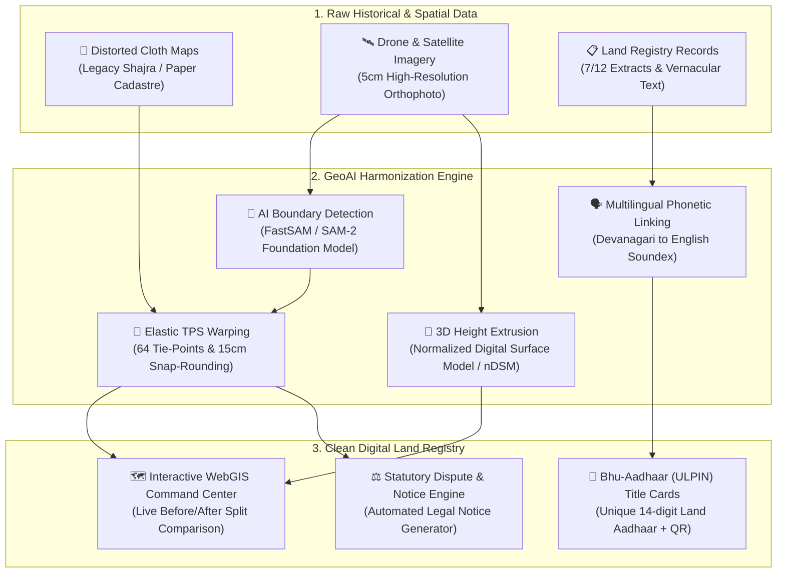

# 🌍 Project A.L.I.G.N.
### **Autonomous Land Integration & GeoAI Network**
*Transforming Legacy Paper Cadastres into Precision 3D Digital Twins with AI*

[](https://sih-project-align.vercel.app)
[](https://github.com/aayushbamal/sih_project_align)
[](https://sih-project-align.vercel.app)
[-6366f1?style=for-the-badge)](https://sih-project-align.vercel.app)

---

### 🌐 Try the Live Interactive Application
👉 **[https://sih-project-align.vercel.app](https://sih-project-align.vercel.app)** *(No login or installation required)*

---

## 📖 The Problem We Are Solving (In Simple Words)

In India, land boundaries for millions of properties were originally drawn decades (or centuries) ago on hand-made cloth and paper maps called **Shajra** or **Village Cadastres**. 

Over time, two major problems occurred:
1. **Physical Distortion**: Paper and cloth naturally stretch, shrink, tear, and warp.
2. **On-Ground Evolution**: Cities expanded, new buildings were constructed, and boundaries shifted.

When surveyors overlay these distorted old maps onto modern satellite or drone photography, **lines don't match reality**. This causes land disputes, delays infrastructure projects, and leads to illegal encroachments on roads and public canals.

---

## 💡 What Project A.L.I.G.N. Does

Think of **Project A.L.I.G.N.** as an **"Autonomous AI Land Surveyor"**. 

It takes distorted legacy cloth maps, analyzes high-resolution drone imagery using modern Computer Vision, and automatically **"snaps" and "straightens"** property boundaries into mathematically perfect, dispute-free digital maps.



---

## 🌟 Key Features Everyone Can Understand

### 1. ↔️ Interactive Before & After Swipe Comparison
* Slide the bar left and right across the map.
* **On the Left (Blue Lines)**: See the original distorted, misaligned cloth map.
* **On the Right (Green/Amber/Red)**: See the AI-corrected, perfectly snapped building footprints aligned with real-world satellite ground truth.

### 2. 🏢 3D Digital Twin (LiDAR & Drone Heights)
* Click **"Enable 3D Extrusion"** to tilt the camera and view actual building heights in 3D.
* AI measures building roof eaves ($0.4\text{m}$ offset) to ensure boundary lines represent true property walls on the ground.

### 3. 🚨 Instant Encroachment & Conflict Detection
* The system automatically scans municipal buffer zones (e.g., $3\text{m}$ stormwater drainage lines and $14\text{m}$ road corridors).
* Parcels encroaching on public land are highlighted in **Crimson Red**, and the system automatically drafts a statutory **Section 248 Land Revenue Notice**.

### 4. 🪪 Instant "Bhu-Aadhaar" (ULPIN) Land ID & QR Cards
* Just like Aadhaar identifies citizens, **ULPIN** (Unique Land Parcel Identification Number) identifies land parcels.
* Click any property on the map to inspect ownership details, legal vs. surveyed area delta, and download a verifiable QR title card.

### 5. 🗣️ Multilingual Name Matching (Devanagari ⇄ English)
* Indian land registries often store owner names in regional scripts (Marathi, Hindi) while modern records use English.
* A.L.I.G.N. uses phonetic AI matching (*IndicSoundex*) to link names like **"संजय दत्तात्रय कुलकर्णी"** to **"Sanjay D. Kulkarni"** without spelling error mismatches.

### 6. 🏙️ Multi-Sector Support
* Explore pre-loaded cadastral sectors with full data:
  * **Ward 14, Pune Urban** (1,420 Parcels)
  * **Ward 03, Nagpur Peri-Urban** (980 Parcels)
  * **Ward 08, Thane Metropolitan** (2,150 Parcels)

---

## 🛠️ Technology Stack (Under the Hood)

| Component | Technology | Purpose |
| :--- | :--- | :--- |
| **Frontend WebGIS** | **React 18 + Vite** | Ultra-responsive command center interface |
| **Map Rendering** | **MapLibre GL JS** | Hardware-accelerated 2D/3D vector & raster mapping |
| **Styling & Icons** | **Tailwind CSS + Lucide** | Clean, dark-mode government dashboard aesthetics |
| **Basemap Provider** | **CARTO Voyager & Esri Satellite** | High-definition satellite & road context tiles |
| **GeoAI Microservice**| **FastAPI + Python 3.11** | High-performance backend API for geospatial algorithms |
| **Geometric Conflation**| **Shapely 2.0 + GeoPandas** | Polygon snapping, vertex rounding, and sliver elimination |
| **Phonetic Matching**| **IndicSoundex + Levenshtein** | Cross-lingual vernacular land record verification |

---

## 🚀 How to Run Locally

### 1. Clone the Repository
```bash
git clone https://github.com/aayushbamal/sih_project_align.git
cd sih_project_align
```

### 2. Run Frontend Command Center
```bash
cd frontend
npm install
npm run dev
```
Open **[http://localhost:3000](http://localhost:3000)** in your browser.

### 3. Run Backend GeoAI Server *(Optional for API evaluation)*
```bash
cd backend
.venv\Scripts\activate
python -m uvicorn app.main:app --port 8000 --host 127.0.0.1
```
Interactive API documentation will be available at **[http://127.0.0.1:8000/docs](http://127.0.0.1:8000/docs)**.

---

## 🏛️ Government Alignment & Compliance
Project A.L.I.G.N. is built in direct alignment with:
* **SVAMITVA Scheme**: Survey of Villages and Mapping with Improvised Technology in Village Areas.
* **NAKSHA Program**: National Cadastral Digitization & Geographic Information System.
* **Department of Land Resources (DoLR)**, Ministry of Rural Development, Government of India.
